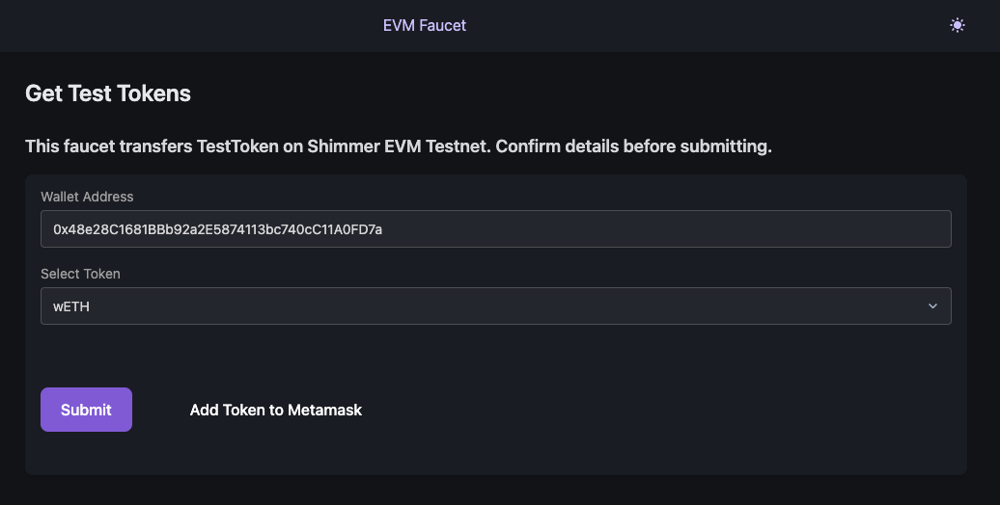

# EVM Faucet App

> The tokens that are dropped by the faucet are not actual wrapped tokens but instead they are simulated wrapped tokens that just exist on our network. This means that these tokens do not have any real-world value and are only meant for testing or educational purposes, and they don't exist on the selected Testnet.

### Uses:
- NodeJs
- Express
- EJS
- [Tailwindcss](https://tailwindcss.com/docs/installation)
- Ethersjs

### Setup

1. `cp .env.example .env` and replace the variables with your custom ones.
2. `npm install`

### Run
`npm start` or `nodemon`

Open the webapp on your browser.
